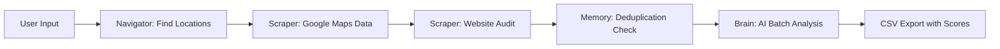

# 🎯 Sentinel - AI-Powered Lead Extractor

> A CLI-based intelligent lead generation system that combines web scraping with AI analysis to identify high-value prospects for AI automation agencies.

[](https://www.python.org/downloads/)
[](https://opensource.org/licenses/MIT)
[](https://playwright.dev/)

---

## 📖 Table of Contents

- [Overview](#overview)
- [Key Features](#key-features)
- [How It Works](#how-it-works)
- [Installation](#installation)
- [Configuration](#configuration)
- [Usage](#usage)
- [Output Format](#output-format)
- [Architecture](#architecture)
- [Lead Scoring Algorithm](#lead-scoring-algorithm)
- [Project Structure](#project-structure)
- [Roadmap](#roadmap)
- [License](#license)

---

## 🚀 Overview

**Sentinel** is an autonomous lead discovery agent designed for AI automation agencies. It scrapes Google Maps for local businesses, performs deep technical audits on their digital infrastructure, and uses AI (Google Gemini) to score and qualify leads based on revenue-loss potential.

### The Problem It Solves

Traditional lead generation is either:
- **Manual & Slow**: Hours of research per lead
- **Generic & Low-Quality**: Spray-and-pray email lists
- **No Intelligence**: Can't identify "hidden pain points"

### The Sentinel Solution

Sentinel identifies businesses with **high reputation but broken digital infrastructure** - the sweet spot where AI automation delivers immediate ROI.

---

## ✨ Key Features

### 🧠 AI-Powered Lead Qualification
- **Batch Processing**: Analyzes 10 leads simultaneously for 10x speed
- **Chain-of-Thought Reasoning**: AI explains *why* each lead is valuable
- **Personalized Hooks**: Generates custom cold email openers per lead

### 🌍 Geographic Intelligence
- **Recursive Radius Expansion**: Automatically searches nearby towns until lead goal is met
- **Saturation Detection**: Skips over-serviced markets automatically
- **Multi-Location Hunts**: Covers entire regions autonomously

### 🔍 Deep Technical Audits
- SSL/HTTPS status
- Mobile responsiveness
- Website age (copyright detection)
- Social media presence (Facebook, LinkedIn, Instagram, etc.)
- Contact extraction (phone, email)
- Chatbot & booking system detection

### 🛡️ Smart Deduplication
- **Place ID Tracking**: Never analyzes the same business twice
- **Persistent Memory**: Uses `history.json` to remember all past leads
- **Multi-Key Rotation**: Automatically switches between 7+ API keys

### ⚡ Performance Optimizations
- **Headless Browser**: Fast parallel scraping with Playwright
- **Rate Limit Management**: Intelligent backoff + key rotation
- **Incremental Saves**: Never lose data mid-hunt

---

## 🧩 How It Works



1. **Navigator** generates strategic locations within radius
2. **Scraper** extracts business data from Google Maps
3. **Scraper** visits websites to audit digital infrastructure
4. **Memory** filters out previously seen leads
5. **Brain** sends batches of 10 to AI for scoring & hook generation
6. **Export** saves results to CSV with all insights

---

## 📦 Installation

### Prerequisites
- Python 3.12+
- Google Gemini API Key(s) ([Get one free](https://makersuite.google.com/app/apikey))

### Step 1: Clone Repository
```bash
git clone https://github.com/umer-80/custom-Lead-extractor.git
cd custom-Lead-extractor
```

### Step 2: Install Dependencies
```bash
pip install -r Requirements/requirements.txt
```

### Step 3: Install Playwright Browsers
```bash
playwright install chromium
```

---

## ⚙️ Configuration

### Create `.env` file
```bash
cp .env.example .env
```

### Add API Keys
```env
# Multiple keys for quota management (comma-separated)
GEMINI_API_KEY=your_key_1,your_key_2,your_key_3

# Optional: Future integrations
GROQ_API_KEY=your_groq_key
HF_API_KEY=your_huggingface_key
```

> **Pro Tip**: Create multiple free Gemini keys from different Google accounts to avoid rate limits.

---

## 🎮 Usage

### Interactive Mode (Recommended)
```bash
python sentinel.py
```

**You'll be prompted for:**
1. **Niche**: e.g., "Dentist", "Gym", "Coffee Shop"
2. **Location**: e.g., "Austin, TX" or "Canberra, Australia"
3. **Hunt Mode**:
   - **Commander (Radius)**: Autonomous multi-location sweep
   - **Surgical (Single)**: One-location precision hunt
4. **Radius** (Commander only): e.g., "50km", "10miles"
5. **Leads Goal** (Commander only): e.g., 50

### CLI Mode (Advanced)
```bash
# Single Location Hunt
python src/main.py "Dentist" "New York"

# Radius Hunt with Goal
python src/main.py "Gym" "London" --radius 50km --goal 100
```

---

## 📊 Output Format

### CSV Columns (Sentinel v4.0 Format)

| Column | Description | Example |
|--------|-------------|---------|
| **1. Business Name** | Company name | "Smile Dental Clinic" |
| **2. Lead Status** | Gold Mine / Broken Pro / Optimized | "Gold Mine" |
| **3. Phone** | Primary contact number | "+61 2 1234 5678" |
| **4. Socials** | Social media links | "facebook.com/smile, instagram.com/smile" |
| **5. Silent Pain** | AI-detected revenue loss insight | "You're losing 40% of bookings because your site is marked 'Not Secure'" |
| **6. Battle Plan** | Recommended service to sell | "AI Appointment Booking System + SSL Fix" |
| **7. Hook** | Personalized cold email opener | "You have 127 5-star reviews but Google marks your site as dangerous..." |

### File Naming Convention
- Single: `leads_Dentist_New_York.csv`
- Navigator: `leads_v4_Dentist_Austin_TX.csv`

---

## 🏗️ Architecture

### Core Modules

#### 1. **sentinel.py** - CLI Interface
- Rich terminal UI with ASCII banner
- User input validation
- Progress tracking

#### 2. **src/main.py** - Orchestration Engine
```python
hunt_location()      # Single-location hunt
run_navigator()      # Multi-location recursive hunt
```

#### 3. **src/scraper.py** - Data Extraction
```python
search_google_maps() # Playwright-based Maps scraper
visit_website()      # Deep website audit
```

#### 4. **src/brain.py** - AI Analysis
```python
analyze_batch()      # Batch-process 10 leads with Gemini
_rotate_key()        # Automatic API key switching
```

#### 5. **src/navigator.py** - Geographic Intelligence
```python
get_locations()      # AI-generated nearby towns/suburbs
```

#### 6. **src/memory.py** - Deduplication
```python
has_seen()          # Check if Place ID exists
remember_lead()     # Add to history.json
```

---

## 🎯 Lead Scoring Algorithm

### Priority 1: "Ghost King" (9-10/10)
**Profile:**
- Rating: 4.2+ ⭐
- Reviews: 20+ 💬
- Website: ❌ None

**Why Valuable:** High trust but zero online conversion path. Immediate ROI from landing page + booking system.

### Priority 2: "Broken Pro" (7-8/10)
**Profile:**
- Has website ✅
- BUT: Insecure SSL ❌ OR No socials ❌ OR Copyright < 2022 ❌ OR Not mobile-ready ❌

**Why Valuable:** Reputation at risk from technical debt. Quick wins from modernization.

### Priority 3: "Modern" (1-3/10)
**Profile:**
- Optimized website ✅
- Active socials ✅
- SSL secure ✅
- Mobile-ready ✅

**Action:** Mark as "Junk" - already well-serviced.

---

## 📁 Project Structure

```
custom-Lead-extractor/
├── sentinel.py                 # Main CLI entry point
├── src/
│   ├── main.py                # Orchestration & hunt logic
│   ├── scraper.py             # Google Maps + Website scraping
│   ├── brain.py               # AI analysis with Gemini
│   ├── navigator.py           # Geographic intelligence
│   └── memory.py              # Deduplication system
├── Requirements/
│   └── requirements.txt       # Python dependencies
├── .env                       # API keys (gitignored)
├── .gitignore                # Ignore patterns
├── history.json              # Lead memory (gitignored)
└── README.md                 # This file
```

---

## 🛠️ Technical Stack

| Category | Technology |
|----------|-----------|
| **Language** | Python 3.12+ |
| **Web Scraping** | Playwright (Chromium headless) |
| **AI Engine** | Google Gemini 2.0 Flash |
| **CLI UI** | Rich |
| **Data Processing** | Pandas |
| **Environment** | python-dotenv |

---

## 🚦 Roadmap

- [ ] Add email verification (Hunter.io integration)
- [ ] Implement lead scoring ML model
- [ ] Add LinkedIn scraping for decision-maker contacts
- [ ] Build web dashboard for lead management
- [ ] Add CRM export (HubSpot, Salesforce)
- [ ] Multi-threading for faster scraping
- [ ] Add proxy rotation for enterprise scale

---

## 📜 License

This project is licensed under the MIT License - see the [LICENSE](LICENSE) file for details.

---

## 👤 Author

**Umer Khan**

- GitHub: [@umer-80](https://github.com/umer-80)
- Project Link: [https://github.com/umer-80/custom-Lead-extractor](https://github.com/umer-80/custom-Lead-extractor)

---

## 🙏 Acknowledgments

- Google Gemini API for AI analysis
- Playwright team for browser automation
- Rich library for beautiful CLI interfaces

---

## ⚠️ Disclaimer

This tool is for legitimate lead generation purposes only. Always respect:
- Website terms of service
- Google Maps ToS
- Data privacy regulations (GDPR, CCPA)
- Rate limits and fair use policies

Use responsibly and ethically.

---

## 💡 Pro Tips

1. **API Keys**: Create 5-7 free Gemini keys for uninterrupted operation
2. **Radius**: Start with 30-50km for suburban areas, 10-20km for dense cities
3. **Niches**: Best results with local service businesses (dentists, gyms, salons, lawyers)
4. **Goal**: Set realistic goals (50-100 leads per hunt) to avoid saturation
5. **Timing**: Run during off-peak hours to reduce rate limit issues

---

<div align="center">

**Built with ❤️ by Umer Khan**

⭐ Star this repo if you found it useful!

</div>
